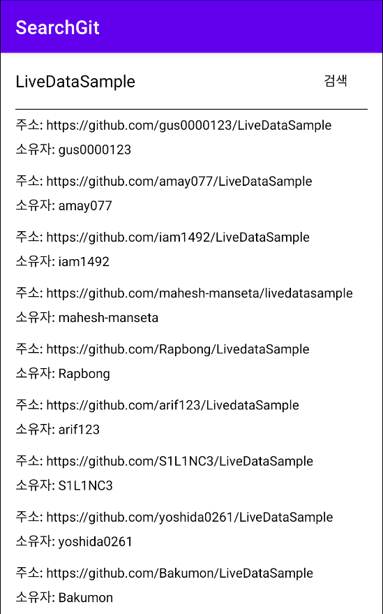
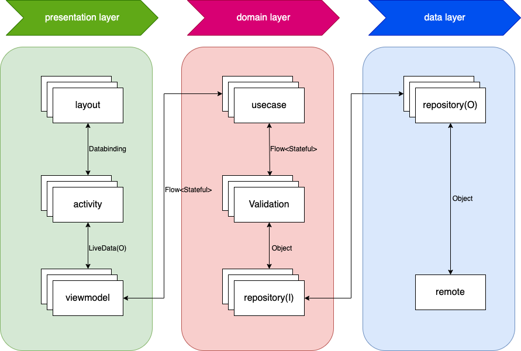

## 안녕하세요 안드로이드 개발자 이종현입니다. 
구현은 Architecture는 MVVM + Clean을 이용하여 구현하였습니다. 
최소한의 기능과 라이브러리만을 이용하여 구현하였기 때문에 MVVM+Clean이 다소 오버스팩일 수 있으나, 샘플용으로 봐주시면 감사하겠습니다. 

실행화면
------------

Data Flow
------------

Layers
------------
- presentation layer(app)
  - View에 관한 내용(xml layout, Activity, Adapter)이 포함되는 레이어입니다.
  - 각 상태별로  Ui업데이트가 가능하도록 구현하였습니다.
- data layer
  - 서버와의 통신을 담당하고 있습니다.(Local Database를 이용한 캐시는 해당 프로젝트에 포함되지 않았습니다.)
  - 서버와의 통신은 mapper를 이용하지 않고, domain layper에 있는 dto클래스를 이용하여 구현하였습니다.
  - Repository의 구현체가 포함되어 있으며, 상세 비즈니스 로직은 이곳에서 구현하였습니다.
- domain layer
  - Repository의 Interface가 포함되어 있으며, (Mock, Fake등을 이용하여)Test Double이 가능하도록 구현하였습니다.
  - UseCase가 포함되어 있으며, UseCase는 단일 책임의 원칙을 강제하기 위하여 invoke(operator)를 이용하여 구현하였습니다. 
  - data는 4가지의 상태(Success, Failure, Empty, Loading)를 가질 수 있도록 구한하였습니다.

Libraries used
------------
- presentation layer(app)
  - livedata
  - viewmodel
  - gson
  - coroutines
  - hilt
- data layer
  - gson
  - coroutines
  - retrofit2
  - okhttp3
  - hilt
- domain layer
  - gson
  - coroutines
